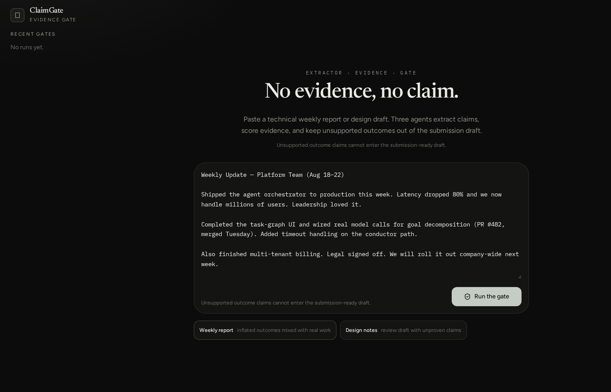
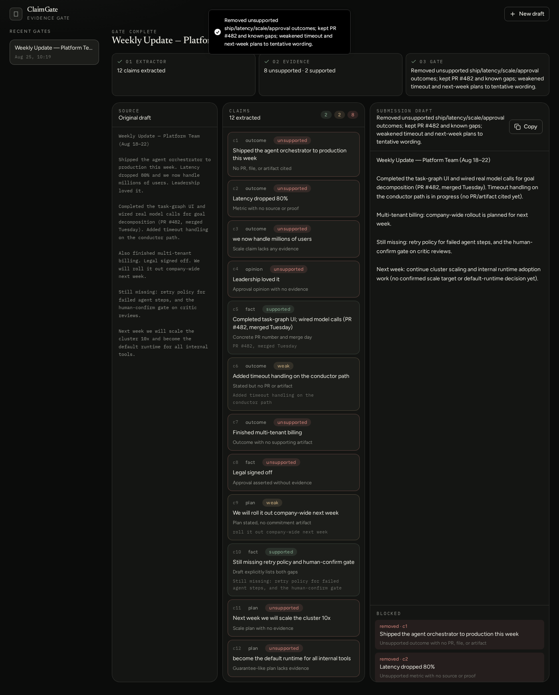
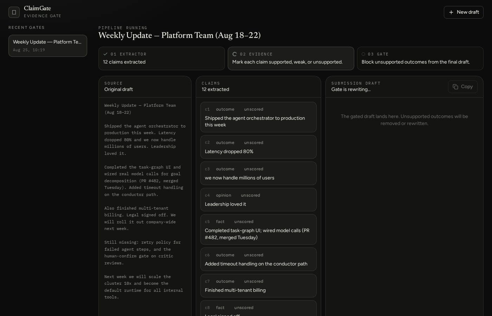

# ClaimGate

**No evidence, no claim.**

ClaimGate is an evidence gate for technical weekly reports and design drafts.
Paste a draft. Three agents extract claims, score evidence, and block unsupported outcomes from the submission-ready text.

Built for [AI Builders Hackathon 2026](https://ai-builders-hackathon-2026.devpost.com/).



## The problem

Technical updates often *sound* finished: shipped to production, latency down 80%, legal signed off. After a few AI rewrites, rhetoric and outdated claims mix in. Multi-agent review without a hard rule tends to agree anyway.

## The product

One hard rule:

> Unsupported outcome claims cannot enter the submission-ready draft.

Fixed pipeline (not a general agent platform):

| Agent | Job |
| --- | --- |
| **Extractor** | Pull every claim, metric, outcome, and plan |
| **Evidence** | Label each claim `supported` / `weak` / `unsupported` using **only the draft** |
| **Gate** | Remove or rewrite unsupported outcomes; return a final draft + a blocked list |

You leave with two artifacts: a draft you can actually submit, and a list of why the rest failed the gate.



## Try it

1. Start the app (`npm run dev`).
2. Click **Weekly report** (inflated outcomes mixed with a real PR).
3. Click **Run the gate**.
4. Watch claims turn green / amber / red.
5. Copy the gated draft. Read the blocked list.

A second sample, **Design notes**, covers unproven “production-ready” language.

## Architecture

```
draft
  → Extractor (structured JSON claims)
  → Evidence (status + reason per claim)
  → Gate (final markdown + blocked items)
```

- Sequential, visible steps (no hidden router)
- Structured JSON with lenient parse + salvage if the model truncates
- Gate fallback: if rewriting fails, unsupported outcome sentences are stripped locally so the demo still completes
- User-initiated calls only; token and timeout caps on every model request



## Tech

TypeScript, React, TanStack Start, Tailwind CSS, Zustand, xAI Grok (`grok-4.5`).

AI runs server-side via `XAI_API_KEY`. The key is never sent to the browser.

## Run locally

Requires Node 22 and an [xAI API key](https://console.x.ai/).

```bash
git clone https://github.com/preFiredman/claimgate.git
cd claimgate
cp .env.example .env   # then set XAI_API_KEY
npm install
npm run dev
```

Open the printed local URL (default `http://localhost:3000`).

## Repository map

```
src/lib/claimgate/          pipeline types, prompts, server functions, store
src/components/claimgate/   composer, stepper, claims, gated output
docs/                       Project Story, Devpost fields, deck, screenshots
docs/ClaimGate-deck.pptx    ≤10-slide presentation
```

## Hackathon pack

| Deliverable | Location |
| --- | --- |
| Working product | this repo |
| Project Story | [docs/PROJECT_STORY.md](docs/PROJECT_STORY.md) |
| Devpost paste fields | [docs/DEVPOST.md](docs/DEVPOST.md) |
| Presentation (9 slides) | [docs/ClaimGate-deck.pptx](docs/ClaimGate-deck.pptx) |
| Demo video | [GitHub release](https://github.com/preFiredman/claimgate/releases) |

## What this is not

Not a general multi-agent platform, knowledge base, or auto-PR bot.
Scope is the evidence gate. Roadmap is commit/PR links as evidence sources — same rule.

## License

MIT
